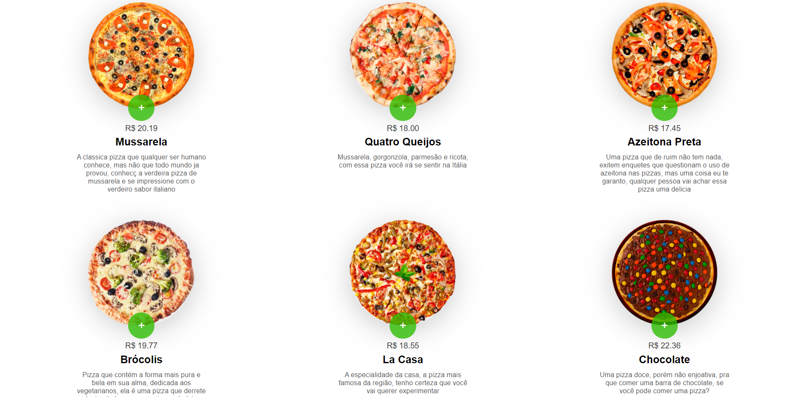
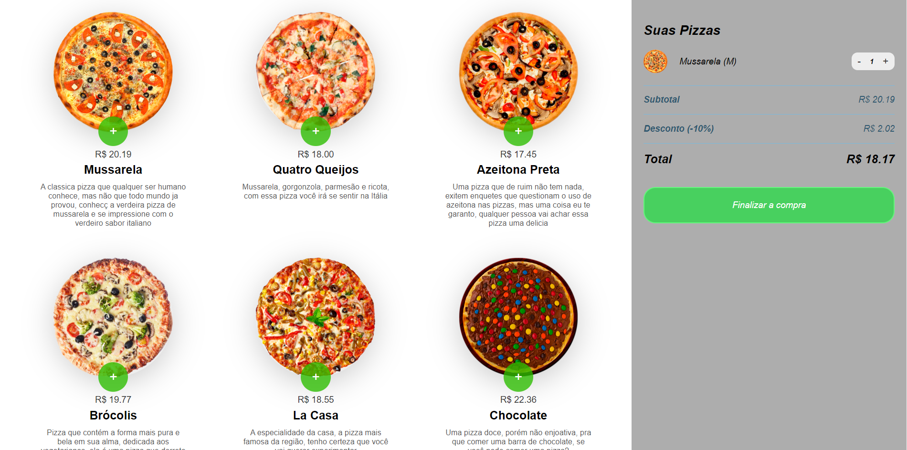
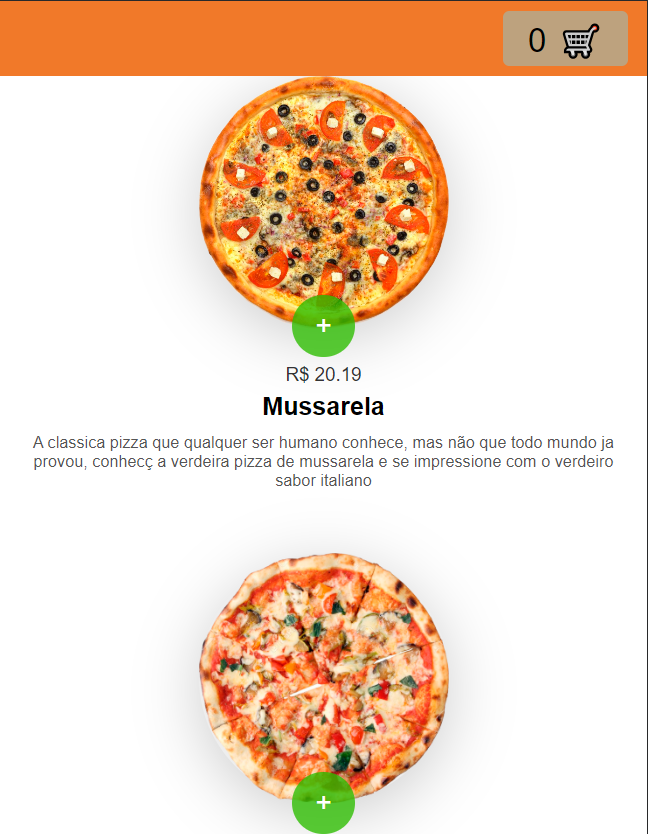
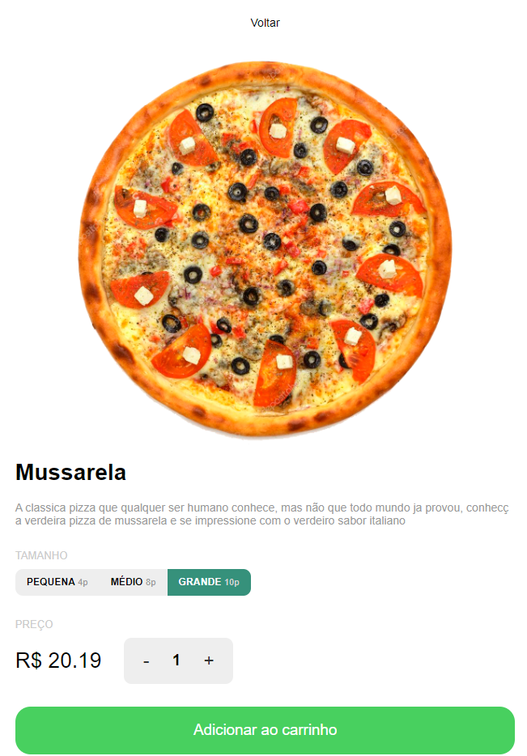
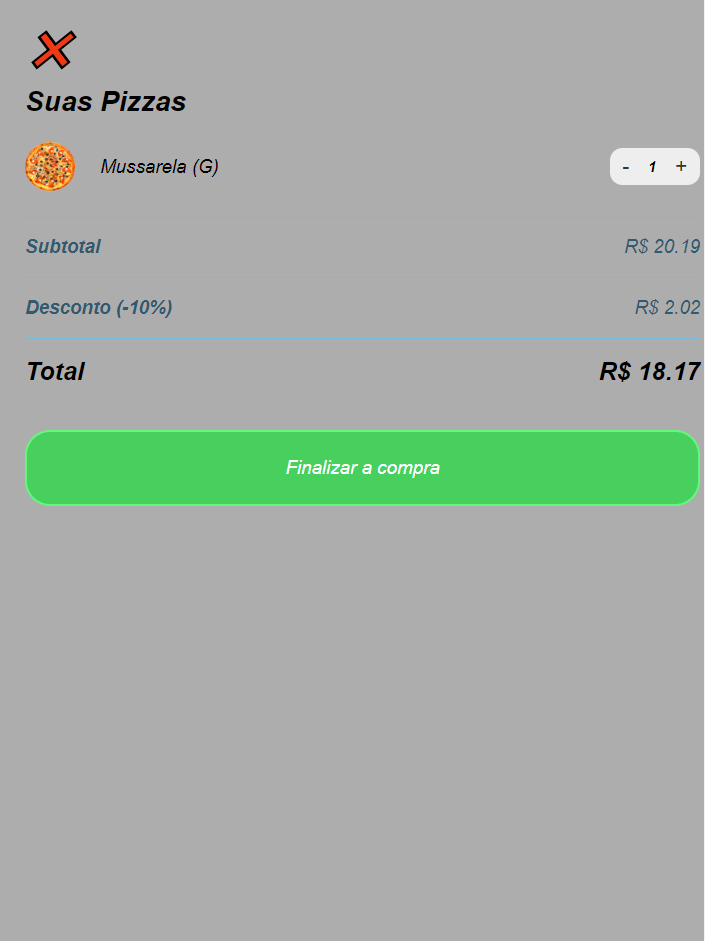

<h1 align="center"></h1>

<h1>🛒 PIZZAS CART SYSTEM </h1>

### 🎯 ABOUT 
Projeto **Front-End** desenvolvido com o **intuito acadêmico**, para **aprendizado** da linguagem de programação **JavaScript**. Esse projeto consiste em carrinho de compras de pizzas, onde você seleciona sua pizza dentro de uma interface intuitiva, escolhe o tamanho e a quantidade, nisso, você será direcionado para o carrinho, onde pode verficar a escolha da(s) pizza(s), podendo adicionar mais unidades, influenciando no preço e finalizar a compra (botão de finalizar a compra **não operacional**)

### 🔨 TOOLS 
- HTML5
- CSS3
- JavaScript

### IMAGES

 
 
 
 

 
 
 

 
 
 

 
 
 

 
 
 

